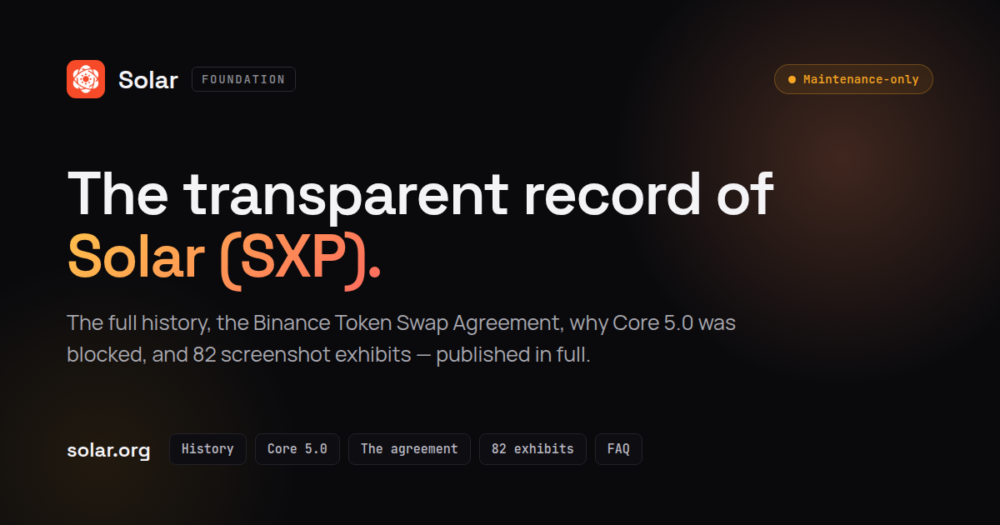

[](https://nayiemw.github.io/solar-foundation-website/)

# Solar Foundation Website

The public transparency website for Solar (SXP): its history, governance, published agreements, community report and supporting evidence.

[Website](https://solar.org) · [Railway deployment](https://solar-foundation-website-production.up.railway.app) · [GitHub Pages mirror](https://nayiemw.github.io/solar-foundation-website/) · [History](https://nayiemw.github.io/solar-foundation-website/history/) · [Evidence](https://nayiemw.github.io/solar-foundation-website/evidence/)

## Explore the record

- A sourced project timeline and governance archive.
- The published Token Swap Agreement and community report.
- A searchable evidence index with 82 screenshot exhibits.
- Archived project statements, frequently asked questions and exchange information.
- Browser-fetched network metrics when the Solar API is available.

The site uses plain HTML, CSS and JavaScript. No application backend or database is required.

## Run locally

With Node.js installed, run from the repository root:

```sh
node solar-site-server.js
```

Open [localhost:3100](http://localhost:3100). The server provides the clean URLs used by the committed site, including `/history` and `/archive/resignation-statement-nayiem-w`.

## Publish with GitHub Pages

The committed `solar-site/` directory is the deployment input. The Pages packaging step adapts its routes and local asset URLs for the repository path:

```sh
python3 scripts/build-pages.py --base-path /solar-foundation-website --output _site
```

GitHub Actions publishes `_site/` after a `dev` → `prod` pull request is merged. `prod` is the default and production branch; make all changes on `dev`.

The Pages site is a mirror. Existing `solar.org` canonical URLs are preserved. See [deployment details](solar-site/DEPLOY.md).

## Railway

Railway deploys `prod` with Railpack and starts the existing Node static server with `npm start`. It serves `solar-site/` at the domain root and listens on Railway's assigned `PORT`. The homepage is the deployment health check. Runtime settings are versioned in `railway.json`.

## Repository

| Path | Purpose |
| --- | --- |
| `solar-site/` | Published HTML, JavaScript, images and documents. |
| `scripts/build-pages.py` | Packages the committed site for GitHub Pages. |
| `solar-site-server.js` | Local server with clean URL support. |
| `solar-build/` | Historical content-generation scripts. |

Historical regeneration requires the original authoring data and environment. It is not required to preview the committed site or deploy the Pages mirror.
